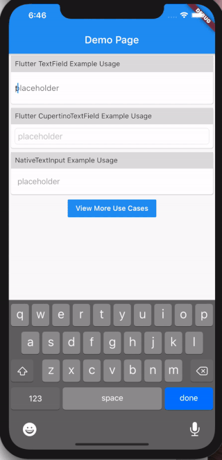
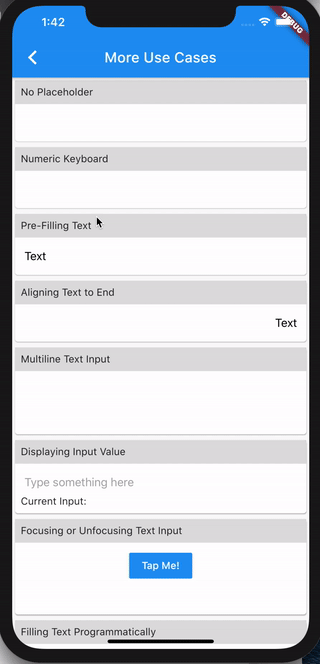

# Native Text Input for Flutter

A text input widget built using the native `UITextView` on iOS and `EditText` on Android. For text view, please refer to [flutter-native-text-view](https://github.com/henryleunghk/flutter-native-text-view).

```
Android support is added in v2 🎉🎉🎉
```
For existing project(s) using v1, please refer to [migration guide](migration-to-v2.md) here.

## Installation

Follow the instructions from https://pub.dev/packages/flutter_native_text_input/install

## Why you should use this

Many mobile app users are used to the subtle features provided by the native iOS or Android systems. Even though Flutter provides a lot of useful widgets, many Flutter developers will notice that `TextField` or `CupertinoTextField` provided by Flutter are [not on par with their native counterpart][1].




The above shows just one of the missing text editing features in Flutter's `TextField`, when comparing to the native iOS `UITextView`. Features like these are especially important if you're building an app that involves a lot of text composition (messaging, editing document, and so on).

To address this, this package simply wraps the native `UITextView` (and `EditText` for Android) as a Flutter widget.

Hope you find it useful and happy coding! 🎉🎉🎉

## Plugin API

| Name            | Type          | Description                    | Default                  |
|:----------------|:--------------|:-------------------------------|:-------------------------|
| `controller`      | TextEditingController  | Controlling the text being edited (https://api.flutter.dev/flutter/material/TextField/controller.html) | null |
| `decoration`      | BoxDecoration          | Controls the BoxDecoration of the box behind the text input (https://api.flutter.dev/flutter/cupertino/CupertinoTextField/decoration.html) | null |
| `focusNode`       | FocusNode              | Defines the keyboard focus for this widget (https://api.flutter.dev/flutter/material/TextField/focusNode.html) | null |
| `iosOptions`      | IosOptions             | iOS only options (cursorColor, keyboardAppearance) | null |
| `keyboardType`    | KeyboardType           | Type of keyboard to display for a given text-based view (https://developer.apple.com/documentation/uikit/uikeyboardtype) | KeyboardType.defaultType |
| `maxLines`        | int                    | The maximum number of lines to show at one time, wrapping if necessary (https://api.flutter.dev/flutter/material/TextField/maxLines.html) | 1 |
| `minHeightPadding` | double                 | Extra vertical spacing added in addition to line height for iOS UITextView to fit well in single line mode | 18.0 |
| `minLines`        | int                    | Minimum number of lines of text input widget | 1 |
| `placeholder`     | String                 | Placeholder text when text entry is empty (https://api.flutter.dev/flutter/cupertino/CupertinoTextField/placeholder.html) | null |
| `placeholderColor`| Color                  | The text color to use for the placeholder text | null |
| `returnKeyType`   | ReturnKeyType          | Constants that specify the text string that displays in the Return key of a keyboard (https://developer.apple.com/documentation/uikit/uireturnkeytype) | ReturnKeyType.defaultAction |
| `style`           | TextStyle              | The style to use for the text being edited [Only `fontSize`, `fontWeight`, `color` are supported] (https://api.flutter.dev/flutter/material/TextField/style.html) | null |
| `textAlign`       | TextAlign              | How the text should be aligned horizontally (https://api.flutter.dev/flutter/material/TextField/textAlign.html) | TextAlign.start |
| `textCapitalization` | TextCapitalization  | Configures how the platform keyboard will select an uppercase or lowercase keyboard (https://api.flutter.dev/flutter/material/TextField/textCapitalization.html) | TextCapitalization.none |
| `textContentType` | TextContentType        | To identify the semantic meaning expected for a text-entry area (https://developer.apple.com/documentation/uikit/uitextcontenttype) | null |
| `onChanged`       | ValueChanged\<String>  | Called when the user initiates a change to text entry (https://api.flutter.dev/flutter/material/TextField/onChanged.html) | null |
| `onEditingComplete` | VoidCallback?        | Called when the user submits editable content (e.g., user presses the "done" button on the keyboard) (https://api.flutter.dev/flutter/material/TextField/onEditingComplete.html) | null |
| `onSubmitted`     | ValueChanged\<String>  | Called when the user indicates that they are done editing the text in the field (https://api.flutter.dev/flutter/material/TextField/onSubmitted.html) | null |

### **IosOptions**
| Name            | Type          | Description                    | Default                  |
|:----------------|:--------------|:-------------------------------|:-------------------------|
| `cursorColor`        | Color               | The color of the cursor (https://api.flutter.dev/flutter/material/TextField/cursorColor.html) | null |
| `keyboardAppearance` | Brightness          | The appearance of the keyboard (https://api.flutter.dev/flutter/material/TextField/keyboardAppearance.html) | null |
| `placeholderStyle`| TextStyle              | The style to use for the placeholder text. [Only `fontSize`, `fontWeight` are supported] (https://api.flutter.dev/flutter/cupertino/CupertinoTextField/placeholderStyle.html) | null |


## More examples

You may find more usage examples [here][2].



## Contributing

### Found a bug?
Please do not hestitate to report that. This cuuld help improve this package.

### Feature request?
Please feel free to create an issue.

### Pull request?
Contributors are welcome. Just create a PR and it would be reviewed and merged ASAP.

If you enjoy using this package or it helps you or your team, you could also buy me a cup of coffee to show support :)

https://PayPal.Me/hkhenryleung/50

## License

This project is licensed under the [MIT License](https://opensource.org/licenses/mit-license.html).

[1]: https://github.com/flutter/flutter/issues/12920
[2]: https://github.com/henryleunghk/flutter-native-text-input/blob/master/example/lib/more_use_case_listing_page.dart
